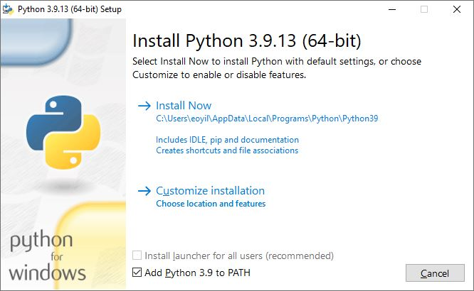
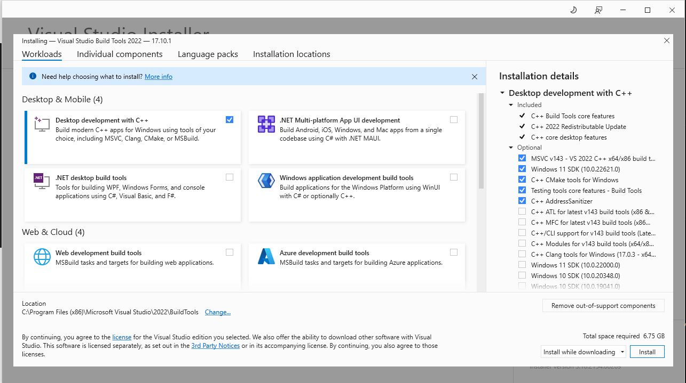

Installation Instructions (Windows)
===================================

Install with Installer
----------------------

We now have a proper [installer](https://www.github.com/eoyilmaz/displaycal-py3/releases) for Windows
and this is the preffered way of running DisplayCAL under Windows (unless you want to
test the latest code).

Install through PyPI
--------------------

If you desire so, you can install DisplayCAL through PyPI. You need to use Python 3.9,
3.10 or 3.11 and use the system Python, so no Virtual Environments. We recommend using
Python 3.11. Here is the installation procedure:

1- Download and install one of Python 3.9, 3.10 or 3.11. Unfortunatelly Python 3.12 is
   not currently working:

   Here is some download links that are now hidden in Python's home page:
   - [python-3.9.13-amd64.exe](https://www.python.org/ftp/python/3.9.13/python-3.9.13-amd64.exe)
   - [python-3.10.11-amd64.exe](https://www.python.org/ftp/python/3.10.11/python-3.10.11-amd64.exe)
   - Python 3.11 can be downloaded directly from [Python.org](https://www.python.org/downloads/windows/).
   - Python 3.12 is not supported currently.

   Some of the libraries that DisplayCAL depends on are not working or not supported
   with Python 3.12. So, stick with Python 3.9, 3.10 or 3.11 until we find a solution.

   Also don't forget to select "Add Python 3.xx to PATH" in the installer.

   

2- Download and install Visual Studio Build Tools:

   Download from https://visualstudio.microsoft.com/visual-cpp-build-tools/

   Select "Desktop development with C++" only:

   

3- Install DisplayCAL through PyPI:

   After both Python and Visual Studio Build Tools are installed run the following in
   the command prompt:

   ```shell
   pip install displaycal
   ```

4- Run DisplayCAL:

   ```shell
   python -m DisplayCAL
   ```

> [!WARNING]
> Under Windows use the system Python installation instead of a virtual environment as
> Wexpect module cannot read ArgyllCMS command outputs from inside a virtual
> environment.

> [!WARNING]
> Under Windows don't run DisplayCAL inside the IDE (Vscode, Pycharm etc.) terminal as
> most of the IDE's are creating virtual terminals and it is not possible to capture the
> command outputs with Wexpect.

Build From Source
-----------------

Under Windows the `makefile` workflow will not work, using a virtual environment is also
breaking Wexpect module, so you need to use your system Python installation. Currently,
DisplayCAL will run with Python 3.9, 3.10 and 3.11, but Python 3.12 is not supported. To
build DisplayCAL from source under Windows follow these steps:

1- Download and install one of Python 3.9, 3.10 or 3.11. Unfortunatelly Python 3.12 is
   not currently working:

   Here is some download links that are now hidden in Python's home page:
   - [python-3.9.13-amd64.exe](https://www.python.org/ftp/python/3.9.13/python-3.9.13-amd64.exe)
   - [python-3.10.11-amd64.exe](https://www.python.org/ftp/python/3.10.11/python-3.10.11-amd64.exe)
   - Python 3.11 can be downloaded directly from [Python.org](https://www.python.org/downloads/windows/).
   - Python 3.12 is not supported currently.

   Some of the libraries that DisplayCAL depends on are not working or supported with
   Python 3.12. So, stick with Python 3.9, 3.10 or 3.11 until we find a solution.

   Also don't forget to select "Add Python 3.xx to PATH" in the installer.

   

2- Download and install Visual Studio Build Tools:

   Download from https://visualstudio.microsoft.com/visual-cpp-build-tools/

   Select "Desktop development with C++" only:

   

3- Download and install Git:

   https://www.git-scm.com/download/win

   When installer asks, the default settings are okay.

4- Clone DisplayCAL repository, build and install it:

   Open up a command prompt and run the following:

   ```shell
   cd %HOME%
   git clone https://github.com/eoyilmaz/displaycal-py3.git
   cd displaycal-py3
   ```

   Then we suggest switching to the `develop` branch as we would have fixes introduced
   to that branch the earliest. To do that run:

   ```shell
   git checkout develop
   ```

  > [!TIP]
  > If you want to switch to some other branches to test the code you can replace
  > `develop` in the previous command with the branch name:
  > ```shell
  > git checkout 367-compiled-sucessfully-in-w10-py311-but-createprocess-fails-call-to-dispread-to-measure
  > ```

   Let's install the requirements, build displaycal and install it:

   ```shell
   pip install -r requirements.txt -r requirements-dev.txt
   python -m build
   pip install dist/DisplayCAL-3.9.*.whl
   ```

5- Run DisplayCAL:

   ```shell
   python -m DisplayCAL
   ```

6- To rebuild and install it again:

   First remove the old installation:

   ```shell
   pip uninstall displaycal
   ```

   Build and install it again:

   ```shell
   python -m build
   pip install dist/DisplayCAL-3.9.*.whl
   ```

Build The Installer
-------------------

To build the installer for your own use you can follow these steps:

1- Follow the instructions explained in
   [Build From Source](#build-from-source) to build DisplayCAL from
   its source.

2- Use the `DisplayCAL\freeze.py` script to generate the frozen executables. Under the
   `displaycal-py3` folder run the following:

   ```shell
   python DisplayCAL\freeze.py
   ```

   This should generate a folder under the `dist` folder with a name similar to
   `py2exe.win32-py3.11-DisplayCAL-3.9.12`.

   All the executables and resources to run DisplayCAL are placed under this folder. So,
   you can directly run the executables under this folder.

3- Download and install [Inno Setup](https://jrsoftware.org/isdl.php#stable):

4- Generate the Inno Setup script:

   ```shell
   python setup.py inno
   ```

   This will generate a file called `py2exe.win32-py3.11-Setup-inno.iss`

5- Run Inno Setup to build the script:

   ```shell
   cd dist
   "C:\Program Files (x86)\Inno Setup 6\iscc" py2exe.win32-py3.11-Setup-inno.iss
   ```

6- This should now generate the installer with the name
   `DisplayCAL-3.9.12-Setup.exe` that you can use to install DisplayCAL to
   any Windows computer.
